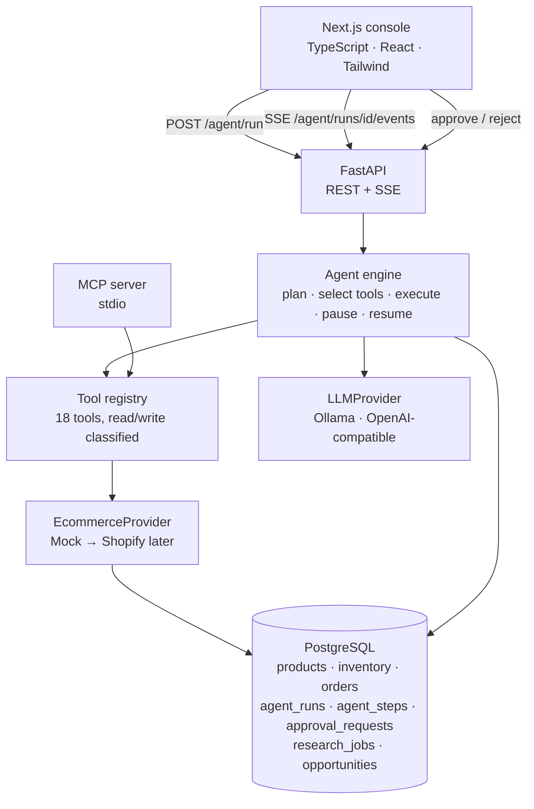

# Ares

**AI E-commerce Operations Agent** — an internal operations console for a product catalog, driven by a tool-using AI agent
that **decides which tools to call**, reads real data from PostgreSQL, proposes changes,
and **pauses for human approval before writing anything**.

It is not a chatbot with a database attached. The agent plans, calls tools in sequence,
inspects each result, and only then answers — and every step is persisted so you can
audit exactly what it did.

```
User: "Find products with poor descriptions and improve the three worst ones."

  → analyze_product_content        scored 42 products, returned 3 weakest
  → generate_product_description   drafted new copy for GYM-003 (18 → 87)
  → generate_product_description   drafted new copy for ELE-002 (18 → 84)
  → generate_product_description   drafted new copy for CLO-004 (20 → 85)
  → update_product                 ⏸ WAITING FOR APPROVAL
  ← human clicks Approve
  → update_product                 applied, 1 field changed
  ✓ Run completed
```

---

## Why it exists

Most "AI for e-commerce" demos are a prompt wrapped around a model. The interesting
engineering problems are the ones a demo skips:

- How does the agent choose tools instead of following a hardcoded flow?
- How do you stop a language model from writing to your production catalog?
- How do you make an autonomous loop terminate?
- How do you show a non-technical operator what the agent actually did?
- How do you swap the model, or the store, without rewriting the agent?

This project is built around those five questions.

---

## Architecture



Separation is deliberate: the engine depends on the `LLMProvider` interface, the tools
depend on the `EcommerceProvider` interface, and the MCP server is a transport over the
same registry the agent uses. No component reaches past its boundary.

```
backend/app/
├── agent/          engine.py (the loop), runner.py (workers), prompts.py
├── tools/          registry.py + products, inventory, analytics, content, intelligence, agent
├── llm/            base.py (interface), ollama.py, openai_compatible.py, factory.py
├── integrations/   base.py (EcommerceProvider), mock_provider.py
├── services/       content_quality.py, approvals.py, runs.py, intelligence*.py
├── intelligence/   crawler.py, discovery.py, extraction.py
├── api/            health, agent, approvals, products, analytics, intelligence
├── db/             base.py, models.py
└── schemas/        domain.py, api.py, intelligence.py
```

---

## The agent loop

`backend/app/agent/engine.py`. Explicit and bounded — no hidden recursion.

```
start / resume
      │
      ▼
┌───► check deadline
│     │
│     ├─ pending tool calls?  ──► drain them
│     │                            ├─ READ  → execute immediately
│     │                            └─ WRITE → create ApprovalRequest, PAUSE ⏸
│     │
│     ├─ iteration / tool-call limit hit? ──► ask for a final summary, stop
│     │
│     ▼
│   llm.chat(messages, tool_specs)
│     │
│     ├─ no tool calls  ──► COMPLETED, return the answer
│     └─ tool calls     ──► queue them, record a decision step
└─────┘
```

Three independent limits stop runaway loops: `AGENT_MAX_ITERATIONS` (LLM round trips),
`AGENT_MAX_TOOL_CALLS`, and `AGENT_TIMEOUT_SECONDS` (wall clock). When a limit is hit
the agent is asked once, without tools, to summarise what it already knows — so you get
a useful answer rather than a truncated log.

**Resumability.** The conversation and the un-drained tool calls are persisted as JSON
columns on `agent_runs`. A run paused for approval holds no process state, so it can be
resumed by any worker — or after a restart.

---

## Tool system

Every capability is a `Tool` with a name, description, Pydantic input model, output
model, category, and read/write classification. Input schemas are generated from the
Pydantic models, so validation and the JSON Schema shown to the model can never drift
apart.

| Category | Tools |
|---|---|
| products | `get_products`, `get_product`, `search_products`, **`update_product`** |
| inventory | `get_inventory`, `get_low_stock_products` |
| analytics | `get_sales_summary`, `get_best_sellers`, `get_product_performance` |
| content | `analyze_product_content`, `generate_product_description`, `generate_product_title` |
| intelligence | `discover_stores`, `crawl_website`, `research_market`, `list_opportunities` |
| agent | `get_agent_run`, `get_recent_agent_runs` |

`GET /tools` returns all of them with their schemas. **Bold = write tool.**

A design decision worth calling out: **`analyze_product_content` is deterministic Python,
not an LLM call** (`services/content_quality.py`). Scoring is a weighted function of
description length, title quality, concrete specifics, use-case language, and filler
detection. If the model ranked "worst products" itself, the same question would return
different products every run and the ranking could not be tested. The LLM is used only
for the creative part — writing the replacement copy.

---

## Human approval

The read/write classification on the tool is the entire safety boundary, and it is
enforced in one place: the engine's drain loop.

```
RUNNING ──► WAITING_FOR_APPROVAL ──► approve ──► execute ──► COMPLETED
                    │
                    └─────────────── reject ──► record, tell the model, ──► COMPLETED
                                                nothing is written
```

- A write tool call **never** executes on its way to the approval queue.
- Approving does not write either — `POST /approvals/{id}/approve` only flips the row's
  status and wakes the run. The engine performs the mutation on its worker.
- Rejecting feeds `{"executed": false, "reason": "A human rejected this change..."}`
  back into the conversation, so the agent reports honestly instead of retrying.
- Each write in a batch gets its own approval, in order. Reads in the same batch still
  run immediately.
- Resolving an approval twice returns `409`.

The approval row stores a before/after preview including the content score delta, which
is what the UI renders.

---

## Observability

Every run writes an ordered `agent_steps` trail — `request`, `decision`, `tool_call`,
`tool_result`, `approval_request`, `approval_resolved`, `final`, `error` — with the tool
input, output, status and duration. The console streams it live over SSE.

```
20:42:11  Analyzing request
20:42:12  Decided to call: analyze_product_content
20:42:12  Calling analyze_product_content
20:42:13  Analyzed 42 products, returned 3 weakest (412 ms)
20:42:18  Drafted a new description for GYM-003 (score 18 → 87)
20:42:18  Waiting for approval: Update Yoga Mat (GYM-003): description
20:43:02  Approval granted for update_product
20:43:03  Updated GYM-003: description (28 ms)
20:43:03  Run completed
```

These are operational events, not chain-of-thought — the model's private reasoning is
never surfaced.

---

## MCP integration

`backend/mcp_server.py` exposes nine store tools over stdio. It is a transport over the
same registry, with the same validation — not a parallel implementation.

```json
{
  "mcpServers": {
    "ecommerce-ops": {
      "command": "python",
      "args": ["-m", "mcp_server"],
      "cwd": "/absolute/path/to/backend",
      "env": { "DATABASE_URL": "postgresql+psycopg://..." }
    }
  }
}
```

Run it directly with `python -m mcp_server`. `GET /mcp/health` imports the server and
reports its real tool list.

Note: `update_product` over MCP is a **direct** write. The approval gate belongs to the
agent engine; an MCP client is already driven by a human who confirms each call in their
own UI. The tool is annotated `destructiveHint` accordingly.

---

## Market intelligence

The **Intelligence** panel queues a public-web investigation such as `fitness accessories`.
Jobs run in backend workers, so they continue without the browser open. They discover
public URLs, crawl bounded same-domain pages, extract JSON-LD/OpenGraph product data,
normalise it, calculate explainable opportunity scores, and persist source evidence.

Crawling checks `robots.txt`, declares a user agent, throttles per domain, respects a
depth/page budget, caches URLs, retries transient failures with backoff, and never
bypasses authentication, CAPTCHAs, paywalls or explicit blocking. Search goes through a
replaceable `SearchProvider` abstraction (DuckDuckGo HTML by default);
`POST /intelligence/jobs` also accepts `start_urls` for deterministic research.

Scraped text is treated as untrusted evidence, never as instructions. Evidence separates
observed facts, calculated metrics and inferred signals — the system never claims an
opportunity *will* generate revenue.

---

## Database

Six core tables plus the intelligence schema, managed with Alembic. JSON columns use
`JSONB` on PostgreSQL and plain `JSON` elsewhere via a SQLAlchemy variant.

| Table | Purpose |
|---|---|
| `products` | catalog: sku, title, description, price, category, status |
| `inventory` | quantity, reorder point, warehouse (one row per product) |
| `orders` | product, quantity, total, created_at |
| `agent_runs` | request, status, timings, serialized conversation, pending tool calls |
| `agent_steps` | the ordered activity trail |
| `approval_requests` | tool name, payload, before/after preview, decision, result |
| `external_stores`, `external_products`, `product_snapshots`, `research_jobs`, `opportunities`, `opportunity_evidence` | market intelligence |

Stock lives in `inventory` rather than on `products` so reorder policy can evolve without
migrating the catalog; the API exposes `inventory_quantity` as a derived field.

---

## Tech stack

**Backend** Python 3.11+ · FastAPI · Pydantic v2 · SQLAlchemy 2.0 · Alembic · PostgreSQL · httpx · pytest
**Frontend** Next.js 16 (App Router) · React 19 · TypeScript · Tailwind CSS v4
**AI** Ollama (default) behind an `LLMProvider` interface; OpenAI-compatible backends supported
**Protocol** MCP over stdio

---

## Setup

### Docker (full stack)

```bash
docker compose up --build
```

Starts PostgreSQL, the API on `:8000`, and the console on `:3000`. The backend container
runs migrations and seeds the demo catalog on start.

Ollama is intentionally **not** a compose service — GPU passthrough differs too much
between machines. Run it on the host and the backend reaches it via
`host.docker.internal`:

```bash
ollama pull llama3.2
ollama serve
```

Everything except answering agent prompts — catalog, analytics, approvals UI, persisted
research — works without it.

### Local (no Docker)

Two terminals from the repository root.

**Backend**

```bash
cd backend
python -m venv .venv
.venv/Scripts/python -m pip install -r requirements-dev.txt   # Linux/macOS: .venv/bin/python
.venv/Scripts/python -m app.seed
.venv/Scripts/python -m uvicorn app.main:app --reload --port 8000
```

`app.seed` creates or upgrades the schema and loads the demo catalog. It resets demo
data by default; `--keep` preserves an existing catalog. API docs: <http://localhost:8000/docs>.

The database defaults to SQLite so a first run needs no PostgreSQL. Set `DATABASE_URL`
to point at Postgres.

**Frontend**

```bash
cp .env.example .env.local    # optional, defaults target port 8000
npm install
npm run dev
```

Open <http://localhost:3000>.

---

## Environment variables

| Variable | Default | Purpose |
|---|---|---|
| `DATABASE_URL` | `sqlite:///./ecommerce_agent.db` | SQLAlchemy URL; use `postgresql+psycopg://...` |
| `LLM_PROVIDER` | `ollama` | `ollama` or `openai_compatible` |
| `OLLAMA_BASE_URL` | `http://localhost:11434` | Ollama endpoint |
| `OLLAMA_MODEL` | `llama3.2` | Model name |
| `OPENAI_BASE_URL` / `OPENAI_API_KEY` / `OPENAI_MODEL` | — | OpenAI-compatible backend |
| `AGENT_MAX_ITERATIONS` | `8` | LLM round trips per run |
| `AGENT_MAX_TOOL_CALLS` | `20` | Tool calls per run |
| `AGENT_TIMEOUT_SECONDS` | `240` | Wall-clock budget per run |
| `CORS_ORIGINS` | `http://localhost:3000` | Comma separated |
| `LOG_LEVEL` | `INFO` | |
| `API_KEY` | — | When set, every request needs a matching `X-API-Key` header. Leave empty for local dev; set in production. |
| `CRAWLER_ALLOW_PRIVATE_ADDRESSES` | `false` | SSRF guard: block private/loopback crawl targets unless explicitly enabled for fixtures. |
| `EMBEDDED_WORKER` | `true` | Local API worker; set `false` for production API replicas and run `python -m app.worker`. |
| `RATE_LIMIT_DISABLED` | `false` | Disable only for controlled tests. |
| `RATE_LIMIT_AGENT_PER_MINUTE` / `RATE_LIMIT_RESEARCH_PER_MINUTE` / `RATE_LIMIT_LOGIN_PER_MINUTE` | `10` / `10` / `20` | Per-process limits for expensive operations. |
| `NEXT_PUBLIC_API_URL` | `http://localhost:8000` | Frontend → API (build-time in Docker) |

No secrets are committed. `.env` files are gitignored; see `.env.example` for the shape.

### Reliability

Research jobs are durable rows. If the backend restarts while a job is queued or running, startup recovery resubmits it automatically; jobs exceeding the recovery window are marked `FAILED` with a clear error instead of staying stuck in `RUNNING`.

### Production worker architecture

For production, run multiple API replicas with `EMBEDDED_WORKER=false` and one or more independent worker processes:

```powershell
python -m app.worker
```

Workers claim queued rows atomically from the shared database, honor priority/idempotency/retry state, reclaim stale work, and can be restarted independently of the API. `/metrics` exposes Prometheus-compatible request, crawler, and job counters/histograms. Every response includes an `X-Correlation-ID` for log correlation.

Authentication supports password-backed sessions via `/auth/register`, `/auth/login`, `/auth/me`, and `/auth/logout`; server-side roles are `admin`, `manager`, `analyst`, and `viewer`. Manager-only audit records are available at `/auth/audit`. The legacy `X-API-Key` remains available for trusted machine clients when `API_KEY` is configured.

---

## Example agent tasks

- "Show me the products with the lowest inventory."
- "Which products have the weakest descriptions?"
- "Analyze our product catalog and tell me what to prioritise."
- "Show me our best-selling products this month."
- "Find products that are missing important information."
- "Improve the descriptions of the three worst products." *(pauses for approval)*
- "What actions did the agent perform today?"
- "Research the market for fitness accessories." *(queues an intelligence job)*

---

## API

| Method | Path | |
|---|---|---|
| GET | `/health` | status of database and model backend |
| GET | `/tools` | every tool with schemas and read/write class |
| GET | `/mcp/health` | MCP server name and tool list |
| POST | `/agent/run` | start a run (202, returns immediately) |
| GET | `/agent/runs` | list runs, filterable by status |
| GET | `/agent/runs/{id}` | full run with steps and approvals |
| GET | `/agent/runs/{id}/events` | SSE stream of the run |
| GET | `/approvals` | pending by default, `?status=all` for history |
| POST | `/approvals/{id}/approve` | approve and resume the run |
| POST | `/approvals/{id}/reject` | reject and resume the run |
| GET | `/products`, `/products/{id}` | catalog with content scores |
| PUT | `/products/{id}` | direct human edit (no approval — a human is doing it) |
| GET | `/analytics/summary` | store-wide dashboard figures |
| POST/GET | `/intelligence/jobs` | queue and list research jobs |
| GET | `/intelligence/opportunities` | scored opportunities and their evidence |

OpenAPI docs are generated at `/docs`.

---

## Testing

```bash
cd backend && .venv/Scripts/python -m pytest      # 92 tests
npm run lint
npx tsc --noEmit
npm run build
npm test                                          # Playwright smoke
```

The backend suite runs against throwaway SQLite with a **scripted LLM provider**
(`tests/fakes.py`) injected through the provider factory, so it needs neither Ollama nor
network access. Coverage focuses on the parts that matter:

- **Agent** — tool selection, multi-tool chains, parallel calls, results fed back into
  context, unknown tools, invalid arguments, failing tools, unreachable LLM, and all
  three loop limits.
- **Approval** — the pause, the before/after preview, DB untouched while pending,
  approve executes, reject writes nothing and is reported to the model, double-resolve
  guard, per-write approvals in a batch.
- **Tools** — every tool's contract, filters, ranking, aggregation, validation errors.
- **Content scoring** — determinism and each scoring component.
- **API** — health, products, analytics, runs, SSE stream, approval endpoints.

Playwright smoke tests expect the backend running and seeded.

---

## Design decisions

**Deterministic content scoring.** Explained above — testable rankings beat a model
guessing twice.

**The engine never sees SQLAlchemy.** Tools go through `EcommerceProvider`. Writing a
`ShopifyProvider` means implementing one interface; the agent, registry and API are
untouched.

**Synchronous backend, threaded workers.** Runs are slow and IO-bound; a small
`ThreadPoolExecutor` with per-worker sessions is simpler to reason about than async
SQLAlchemy and just as adequate at this scale.

**SSE by polling the step table.** The stream reads committed rows rather than an
in-memory bus, so it works across workers and would keep working across processes. The
stream closes when a run pauses; the client reopens it after the approval is resolved.

**SQLite default.** `pytest` and a first local run need zero infrastructure. Docker
compose provides real PostgreSQL.

---

## Limitations and future work

- **Single-user.** No authentication or multi-tenancy; the API is unauthenticated and
  meant to run locally. Auth would go in front of `/agent` and `/approvals` first.
- **Small models wander.** With `llama3.2`, expect occasional redundant tool calls. The
  loop limits contain it, and there is a recovery path that parses a tool call emitted
  as plain text. A larger model follows the sequence more reliably.
- **No streaming tokens.** Events stream; the final answer arrives whole.
- **Approvals are all-or-nothing.** You cannot edit the proposed text before approving —
  only approve or reject, then re-run.
- **`get_product_performance` is per product.** A bulk variant would save round trips on
  catalog-wide questions.
- **Research quality depends on the public web.** Crawls are bounded and polite by
  design, so coverage is deliberately shallow.

Natural next steps: a `ShopifyProvider` against the real Admin API, editable approvals,
scheduled agent runs, and per-tool rate limits.
